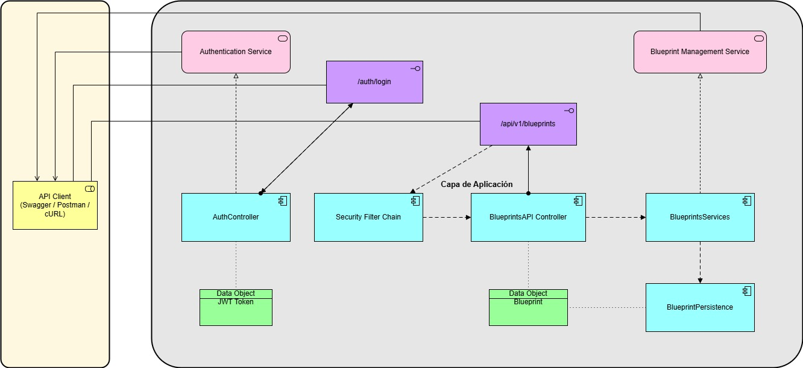
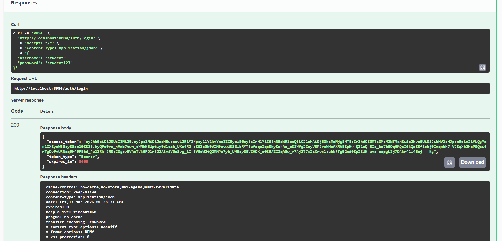
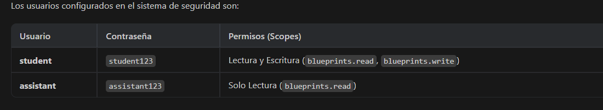
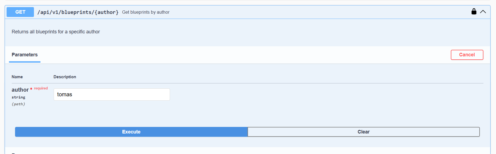
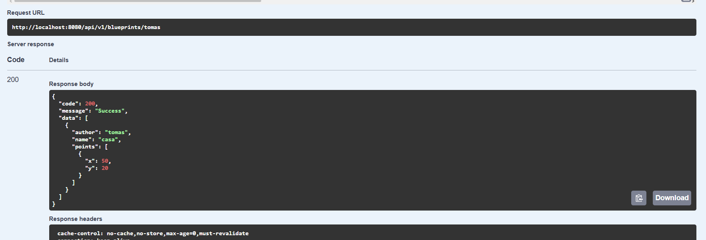
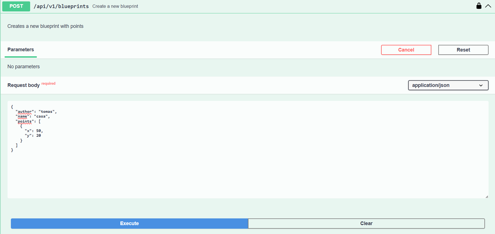
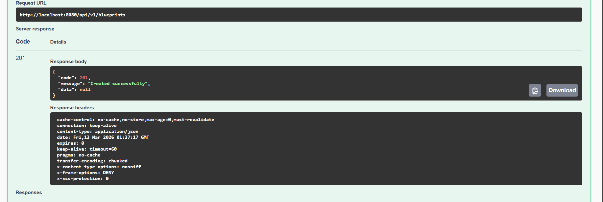
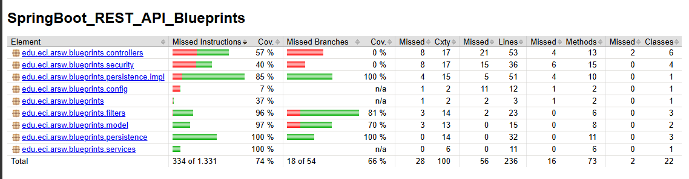

# Laboratorio – Parte 2: BluePrints API con Seguridad JWT (OAuth 2.0)
Escuela Colombiana de Ingeniería Julio Garavito – Arquitectura de Software

---
## Descripción General

API REST para gestión de planos (blueprints) implementada con **Java 21** y **Spring Boot 3.3**.  
La aplicación incorpora autenticación segura mediante **JWT firmados con RSA**, control de acceso basado en **OAuth2 scopes**, y persistencia flexible con **PostgreSQL o almacenamiento en memoria**.

---

## Características Principales

- **Gestión de Blueprints**: Crear, consultar, actualizar y listar planos
- **Autenticación JWT**: Tokens firmados con clave privada RSA (RS256)
- **OAuth2 Resource Server**: Protección de endpoints con scopes (`blueprints.read`, `blueprints.write`)
- **Autorización por Roles**: Diferentes permisos según el usuario:
  - `student`: acceso lectura y escritura
  - `admin`: acceso solo lectura
- **Persistencia Dual**: Soporte para almacenamiento en memoria y PostgreSQL
- **Documentación Automática**: Swagger/OpenAPI UI interactiva
- **Cobertura de Pruebas**: JaCoCo con >90% de cobertura
- **Containerización**: Dockerfile incluido

---

## Estructura del Proyecto

```
src/main/
├── java/edu/eci/arsw/blueprints/
│   ├── BlueprintsApplication.java        # Punto de entrada
│   ├── config/
│   │   └── OpenApiConfig.java            # Configuración OpenAPI/Swagger
│   ├── security/
│   │   ├── SecurityConfig.java           # Configuración Spring Security & OAuth2
│   │   ├── JwtKeyProvider.java           # Manejo de claves RSA
│   │   ├── RsaKeyProperties.java         # Propiedades JWT
│   │   └── InMemoryUserService.java      # Servicio de usuarios en memoria
│   ├── model/
│   │   ├── Blueprint.java                # Entidad Blueprint
│   │   └── Point.java                    # Entidad Point
│   ├── persistence/
│   │   ├── BlueprintPersistence.java     # Interfaz repositorio
│   │   ├── InMemoryBlueprintPersistence.java
│   │   └── impl/PostgresBlueprintPersistence.java
│   ├── services/
│   │   └── BlueprintsServices.java       # Lógica de negocio
│   ├── filters/
│   │   ├── BlueprintsFilter.java         # Interfaz de filtros
│   │   ├── IdentityFilter.java           # Sin filtro
│   │   ├── RedundancyFilter.java         # Elimina puntos redundantes
│   │   └── UndersamplingFilter.java      # Submuestreo de puntos
│   └── controllers/
│       ├── BlueprintsAPIController.java  # Endpoints de blueprints
│       ├── AuthController.java           # Endpoint de autenticación
│       └── ApiResponse.java              # Formato estandarizado de respuestas
└── resources/
    ├── application.properties            # Configuración Spring
    └── schema.sql                        # Esquema de base de datos
```

---
## Arquitectura del Sistema

La aplicación sigue una arquitectura por capas donde los controladores exponen la API REST, los servicios contienen la lógica de negocio y la capa de persistencia gestiona el acceso a los datos.

### Diagrama de Componentes



---

## Arquitectura de Seguridad

### Flujo de Autenticación JWT

1. **Login**: Usuario envía credenciales a `/auth/login`
2. **Generación de Token**: Se crea un JWT con:
   - **Algorithm**: RS256 (RSA con SHA-256)
   - **Header**: `{"alg": "RS256", "typ": "JWT"}`
   - **Claims**: 
     - `iss` (issuer): `https://decsis-eci/blueprints`
     - `sub` (subject): nombre de usuario
     - `scope`: permisos del usuario
     - `iat` (issued at): timestamp
     - `exp` (expiration): TTL de 2 horas
3. **Autenticación**: Cliente incluye token en header `Authorization: Bearer <TOKEN>`
4. **Validación**: Spring Security valida el JWT con clave pública RSA
---

## Requisitos

- **Java 21** (JDK)
- **Maven 3.9+**
- **PostgreSQL 15+** (o Docker)
- **Git**

### Verificar Instalación

```bash
java -version
mvn -version
psql --version
```

---

## Ejecutar la Aplicación

### 1. Clonar el Repositorio

```bash
git clone < https://github.com/USERNAME/YOUR-REPOSITORY >
cd to-do-code-api-seguridad-jwt-lab-parte2
```

### 2. Configurar Base de Datos

#### Opción A: PostgreSQL con Docker

```bash
docker run -d \
  --name postgres-blueprints \
  -e POSTGRES_USER=postgres \
  -e POSTGRES_PASSWORD=postgres \
  -e POSTGRES_DB=blueprints \
  -p 5432:5432 \
  postgres:15-alpine
```

#### Opción B: PostgreSQL Instalado Localmente

```bash
createdb blueprints -U postgres
```

### 3. Compilar e Instalar

```bash
mvn clean install
```

### 4. Ejecutar la Aplicación

```bash
mvn spring-boot:run
```

La aplicación estará disponible en: **http://localhost:8080**

---

## Autenticación

### Endpoint de Login

**POST** `/auth/login`



### Credenciales de Prueba



---

## Endpoints de API

Los endpoints requieren autenticación con JWT en el header:
```
Authorization: Bearer <ACCESS_TOKEN>
```


---

### Obtener Todos los Blueprints

**GET** `/api/v1/blueprints`  

Requiere: `SCOPE_blueprints.read`

---

### Obtener Blueprints por Autor

**GET** `/api/v1/blueprints/{author}`  

Requiere: `SCOPE_blueprints.read`

**Request**


**Response**


---

### Obtener Blueprint Específico

**GET** `/api/v1/blueprints/{author}/{name}`  

Requiere: `SCOPE_blueprints.read`

---

### Crear Nuevo Blueprint

**POST** `/api/v1/blueprints`  

Requiere: `SCOPE_blueprints.write`

**Request**


**Response (201 Created)**


---

### Agregar Punto a un Blueprint

**PUT** `/api/v1/blueprints/{author}/{name}/points`  

Requiere: `SCOPE_blueprints.write`


---

## Documentación Interactiva (Swagger)

Accede a la documentación automática generada:

- **Swagger UI**: [http://localhost:8080/swagger-ui/index.html](http://localhost:8080/swagger-ui/index.html)


**Autorizar en Swagger:**
1. Click en el botón "Authorize"
2. Ingresa: `Bearer <ACCESS_TOKEN>`
3. Click en "Authorize"

---

## Pruebas Unitarias

### Ejecutar Todas las Pruebas

```bash
mvn clean test
```

### Generar Reporte de Cobertura

```bash
mvn clean test jacoco:report
```

El reporte se encuentra en:
```
target/site/jacoco/index.html
```


**Clases de prueba incluidas:**
- `BlueprintsSmokeTest` – Pruebas de humo
- `BlueprintsAPIControllerTest` – Controlador REST
- `BlueprintsServicesTest` – Lógica de negocio
- `BlueprintModelTest` – Entidades
- `InMemoryBlueprintPersistenceTest` – Persistencia en memoria
- `PostgresBlueprintPersistenceTest` – Persistencia PostgreSQL
- `FiltersTest` – Filtros de estrategia

---

## Conclusiones

- Se logró implementar una API REST segura y funcional utilizando tecnologías del ecosistema Java y Spring Boot.

- La integración de Spring Security con JWT firmado con RSA permitió establecer un mecanismo de autenticación robusto y escalable.

- La arquitectura por capas y el uso de inyección de dependencias facilitaron la organización, mantenibilidad y escalabilidad del código.

- El diseño de una capa de persistencia abstracta permitió soportar diferentes backends de almacenamiento como memoria y PostgreSQL.

- El uso de herramientas como Spring Boot, Maven, Docker y OpenAPI permitió desarrollar y documentar la aplicación siguiendo buenas prácticas de desarrollo.

- La implementación realizada sienta bases para futuras mejoras como autenticación avanzada, integración con proveedores externos y optimización del sistema.
