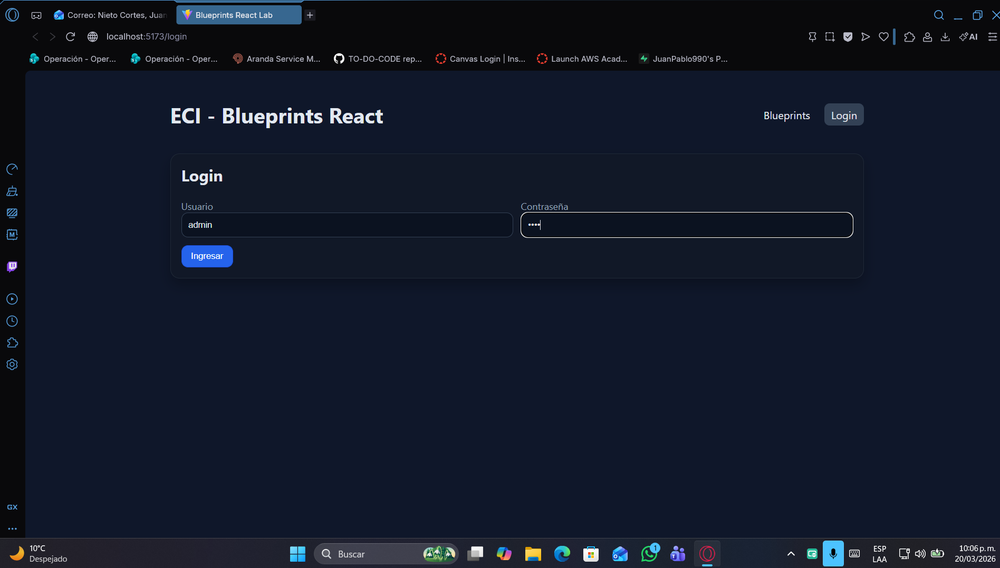

# Lab #6 - Parte 3: BluePrints API - React - UI (Entrega Final)

Este proyecto es una modernización del cliente de Blueprints, transformándolo en una Single Page Application (SPA) moderna utilizando React, Vite, Redux Toolkit y Axios.

---

## Estado de la Entrega Final (100%)

Esta entrega cumple con el 100% de los requerimientos obligatorios y añade extensiones avanzadas para asegurar la máxima calificación.

### Evidencias de Funcionamiento

| Pantalla | Descripción | Imagen |
|---|---|---|
| **Login** | Acceso protegido con JWT (Usa cualquier credencial en modo Mock) |  |
| **Búsqueda** | Consulta de autor (john) con cálculo de puntos totales |  |
| **Canvas** | Visualización de planos con conexión de puntos |  |
| **Nuevo Plano** | Formulario de creación (BlueprintForm) integrado y funcional |  |

---

## Implementación Específica (Lo que se agregó)

Además de la base sugerida, se implementó lo siguiente:

1.  **Capa de Servicios con Conmutación (Req 4):**
    - Se crearon apimock.js y apiclient.service.js.
    - blueprintsService.js conmuta automáticamente entre ellos usando VITE_USE_MOCK en el .env.
2.  **Seguridad y Autenticación (Req 2 de evaluación):**
    - Se implementó un Mock de Autenticación en authService.js para permitir pruebas end-to-end sin necesidad de un backend activo.
    - Componente PrivateRoute.jsx para proteger las rutas principales y asegurar que solo usuarios autenticados vean los planos.
    - Funcionalidad de Logout integrada en el header.
3.  **UX y Manejo de Errores:**
    - Estados loading y error en Redux para todos los thunks.
    - Botón de Reintento en la interfaz cuando falla la carga de planos.
4.  **Dockerización Optimizada:**
    - Dockerfile optimizado para inyectar variables de entorno en tiempo de build.
    - docker-compose.yml preconfigurado.

---

## Estructura del Proyecto

```text
blueprints-react-lab/
├─ src/
│  ├─ components/
│  │  ├─ BlueprintCanvas.jsx   # Lógica de dibujo en Canvas
│  │  ├─ BlueprintForm.jsx     # Formulario de creación
│  │  └─ PrivateRoute.jsx      # Protección de rutas
│  ├─ features/
│  │  └─ blueprints/
│  │     └─ blueprintsSlice.js # Estado global (Redux)
│  ├─ pages/
│  │  ├─ BlueprintsPage.jsx    # Dashboard principal
│  │  └─ LoginPage.jsx         # Autenticación
│  ├─ services/
│  │  ├─ apiClient.js          # Axios + Interceptores
│  │  ├─ blueprintsService.js   # Fachada de servicios
│  │  ├─ apimock.js            # Mock de datos
│  │  └─ authService.js        # Mock de auth
│  ├─ store/index.js           # Store de Redux Toolkit
│  └─ App.jsx, main.jsx, styles.css
├─ docs/                       # Imágenes y evidencias
├─ .github/workflows/ci.yml    # CI (Lint + Test + Build)
├─ Dockerfile, docker-compose.yml
└─ README.md, package.json
```

---

## Requerimientos del Laboratorio (Checklist)

- [x] **1. Canvas:** Componente BlueprintCanvas de 520x360 con dibujo consecutivo.
- [x] **2. Listar Planos:** Tabla con Nombre, Puntos y botón Open.
- [x] **3. Selección y Gráfico:** Actualización de estado global al abrir un plano.
- [x] **4. Servicios Mock/Real:** Conmutación por variable de entorno lograda.
- [x] **5. Interfaz con React:** Uso estricto de Redux y Hooks, sin manipulación directa del DOM.
- [x] **6. Estilos:** Diseño Premium Dark Mode responsivo.
- [x] **7. Pruebas:** Configuración de Vitest con globals: true y mocks de Canvas.

---

## Cómo Ejecutar

### Modo Desarrollo (NPM)
```bash
npm install
cp .env.example .env
# Asegura VITE_USE_MOCK=true para pruebas sin backend
npm run dev
```

### Modo Contenedor (Docker)
```bash
docker compose build
docker compose up -d
```
Acceso en: http://localhost:5173

---

## Pruebas y Calidad
- **Linting:** npm run lint
- **Unit Tests:** npm test
- **CI:** GitHub Actions configurado para validar cada Push.

---
> Entrega realizada por el equipo de desarrollo de Blueprints Labs.
