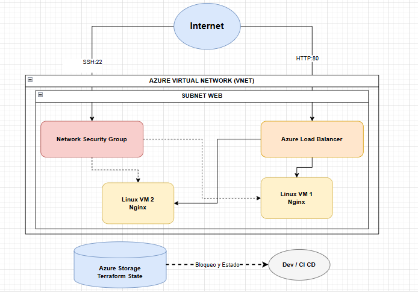
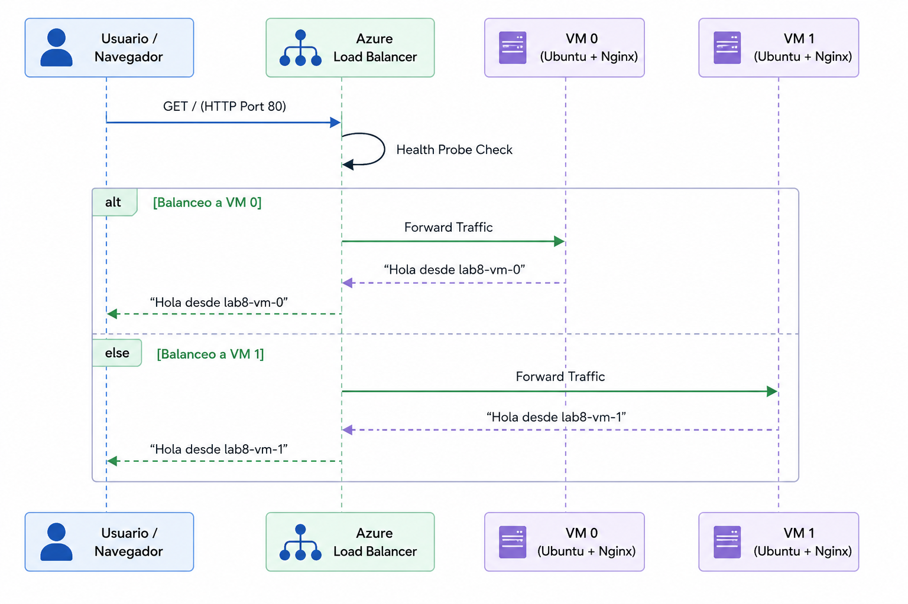

# Informe Laboratorio #8 — Infraestructura como Código con Terraform (Azure)

**Integrantes:** 
María Paula Rodríguez
Juan Andres Suárez
Juan Pablo Nieto
Tomas Ramirez
**Curso:** BluePrints / ARSW  

Este repositorio contiene la solución completa al Laboratorio #8, demostrando el uso de **Terraform** para provisionar infraestructura como código (IaC) en Microsoft Azure de manera modular, escalable y segura.

---

## 🎥 Video Demostrativo

Puedes ver la demostración y explicación del funcionamiento de esta infraestructura en el siguiente enlace:

[](https://pruebacorreoescuelaingeduco-my.sharepoint.com/:v:/g/personal/juan_nieto-co_mail_escuelaing_edu_co/IQBa44rYbkgTSqj8KQlQqoVnAbSlq_VbMmJF5jdAHJJI080?nav=eyJyZWZlcnJhbEluZm8iOnsicmVmZXJyYWxBcHAiOiJPbmVEcml2ZUZvckJ1c2luZXNzIiwicmVmZXJyYWxBcHBQbGF0Zm9ybSI6IldlYiIsInJlZmVycmFsTW9kZSI6InZpZXciLCJyZWZlcnJhbFZpZXciOiJNeUZpbGVzTGlua0NvcHkifX0&e=sQjQcf)

---

## 1. Arquitectura y Diagramas

La arquitectura implementada consta de un Load Balancer público de Azure que distribuye el tráfico HTTP hacia dos máquinas virtuales Linux (Ubuntu) ubicadas en una subred privada, las cuales ejecutan Nginx instalado automáticamente mediante `cloud-init`.

### Diagrama de Componentes (Infraestructura)



### Diagrama de Secuencia (Flujo de Petición)



---

## 2. Reflexión Técnica

### Decisiones de Diseño y Trade-offs
* **L4 Load Balancer vs Application Gateway (L7):** Para este laboratorio optamos por un Load Balancer L4 (Azure Load Balancer) debido a que solo necesitamos distribuir tráfico TCP en el puerto 80 sin inspeccionar la capa HTTP (por ejemplo, sin ruteo por rutas de URL). El Load Balancer es más rápido y económico para este escenario básico. Si estuviéramos en producción con microservicios web expuestos por diferentes URLs, habríamos utilizado el *Application Gateway* (L7).
* **Modularización:** Dividimos el código en los módulos `vnet`, `compute` y `lb` para garantizar la reutilización del código. Esto facilita que equipos independientes manejen redes y cómputo sin interferir entre sí.

### Seguridad
* **Autenticación por SSH Key:** Deshabilitamos la autenticación por contraseña en las VMs. Se generó un par de claves `ed25519` de manera local y Terraform inyectó la clave pública, asegurando que solo el equipo de desarrollo pueda acceder por SSH.
* **Network Security Group (NSG) Estricto:** Limitamos el acceso SSH (`puerto 22`) exclusivamente a la dirección IP pública actual del desarrollador (`191.108.23.15/32`). El puerto HTTP (`80`) quedó expuesto al público solo a nivel de Load Balancer para atender la página web.

### Estimación de Costos
* **VMs (`Standard_B1s`):** ~$7.50 USD mensuales por cada una (~$15.00 USD en total).
* **Load Balancer (Standard SKU):** Cargos mínimos por horas de procesamiento y reglas de tráfico (aprox. $18.00 USD mensuales).
* **Public IP (Static):** ~$3.60 USD mensuales.
* **Storage Account (Backend de Terraform):** Céntimos al mes, ya que el archivo `.tfstate` pesa menos de 100 KB.
* **Total estimado en producción 24/7:** ~$37.00 USD / mes. Al usar el comando `destroy` post-laboratorio, el costo se reduce a cero.

---

## 3. Evidencias de Instalación y Configuración

A continuación se presentan los registros de la configuración del entorno y la instalación de Terraform:

### Instalación de Terraform (Winget)
```powershell
PS C:\WINDOWS\system32> winget install HashiCorp.Terraform
Encontrado HashiCorp Terraform [Hashicorp.Terraform] Versión 1.15.2
Esta aplicación tiene licencia del propietario.
Descargando https://releases.hashicorp.com/terraform/1.15.2/terraform_1.15.2_windows_amd64.zip
Instalado correctamente
```

### Verificación de Instalación
```powershell
PS C:\WINDOWS\system32> terraform -version
Terraform v1.15.2
on windows_amd64
```

### Autenticación en Azure y Creación del Backend
```powershell
PS C:\> az login --use-device-code
To sign in, use a web browser to open the page https://login.microsoft.com/device and enter the code FBFM5NQQ8 to authenticate.

[
  {
    "cloudName": "AzureCloud",
    "name": "Azure for Students",
    "state": "Enabled",
    "user": {
      "name": "tomas.ramirez@mail.escuelaing.edu.co",
      "type": "user"
    }
  }
]

PS C:\> az group create -n rg-tfstate-lab8-can -l canadacentral
{
  "location": "canadacentral",
  "name": "rg-tfstate-lab8-can",
  "properties": { "provisioningState": "Succeeded" }
}
```

---

## 4. Guía de Ejecución y Destrucción

### Despliegue

```bash
cd infra
az login
terraform init -backend-config=backend.hcl
terraform validate
terraform plan -var-file=env/dev.tfvars -out plan.tfplan
terraform apply "plan.tfplan"
```

### Destrucción Segura

Al finalizar cualquier validación, es **mandatorio** ejecutar:

```bash
cd infra
terraform destroy -var-file=env/dev.tfvars -auto-approve
```
Esto garantiza que los recursos aprovisionados desaparezcan y no se consuman créditos adicionales.
